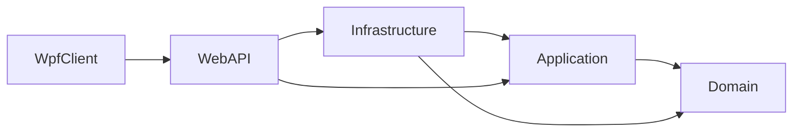
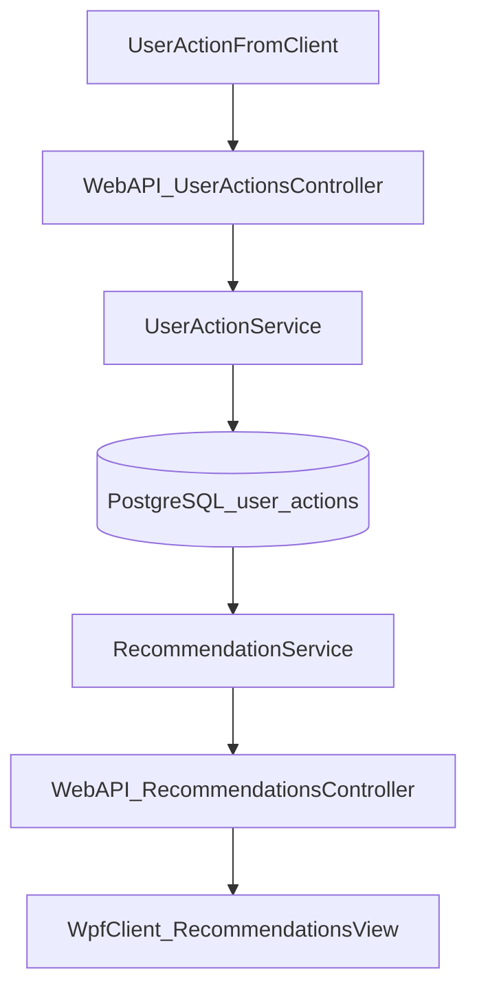
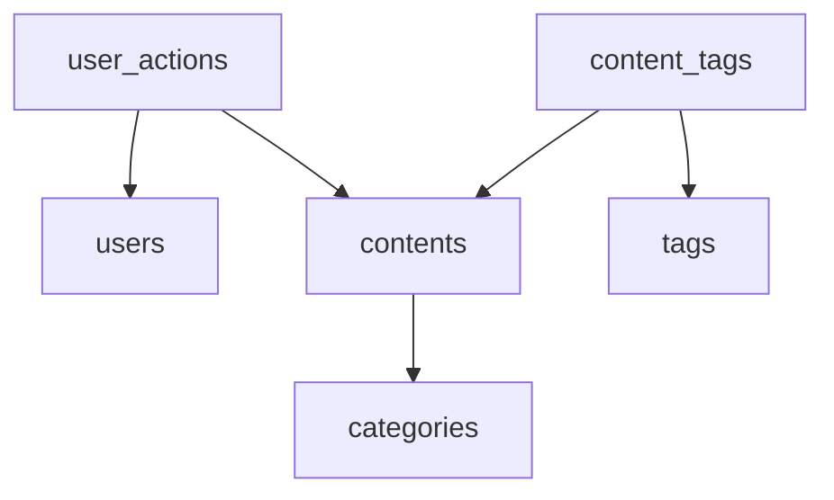

# Архитектура проекта

## Clean Architecture

## Поток данных: действие пользователя -> рекомендации

## Модель данных (основные таблицы)

## Краткое описание алгоритмов рекомендаций

- `Popular`: ранжирование по суммарному весу действий (`View=1`, `Click=2`, `Like=3`).
- `ByCategories`: приоритет контента из категорий, где у пользователя больше активности.
- `KNN`: поиск похожих пользователей по cosine similarity вектора действий, затем рекомендация контента ближайших соседей.

