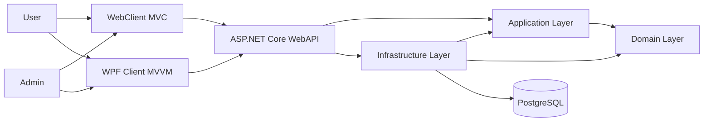
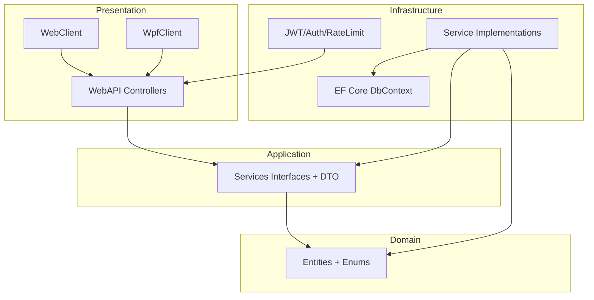
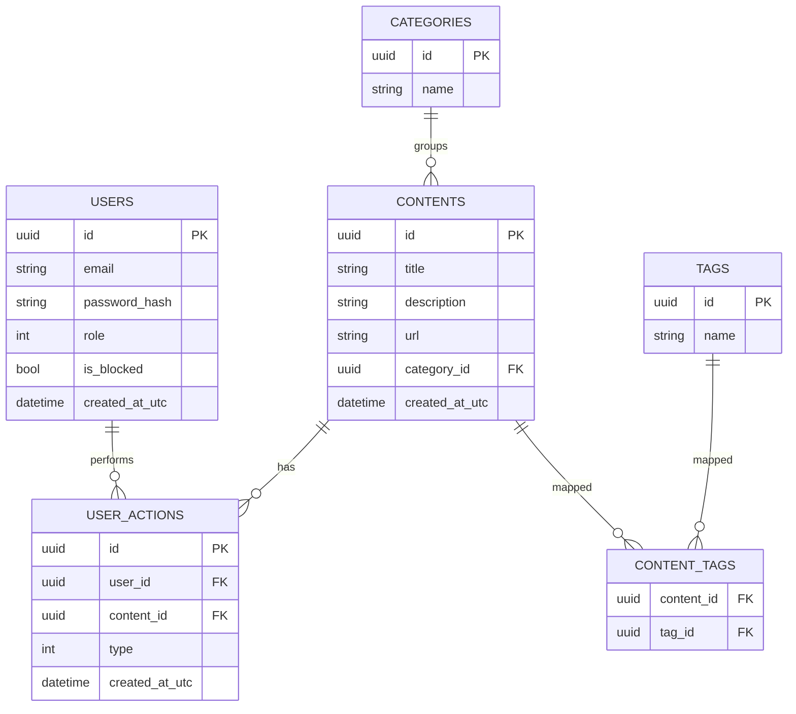
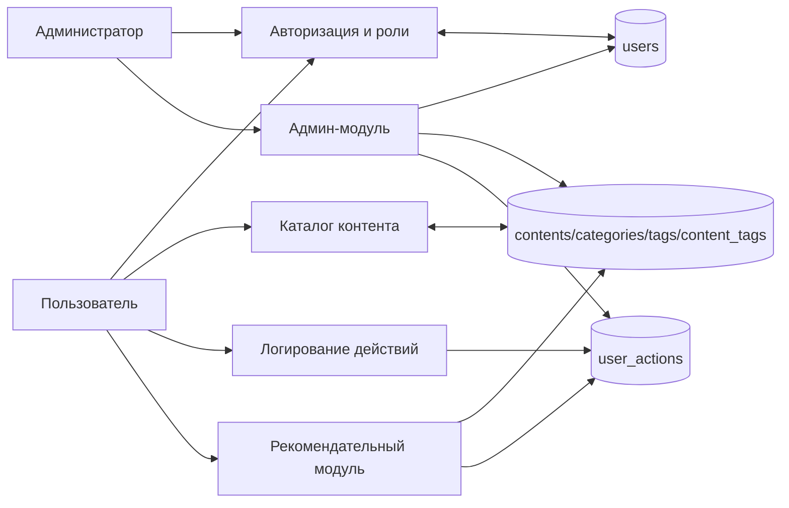
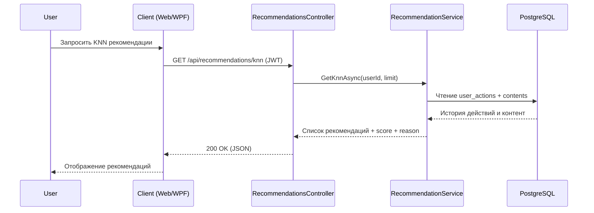
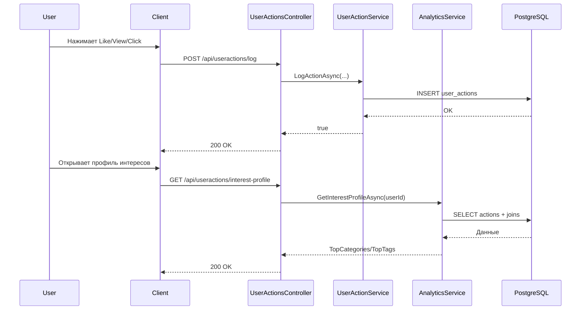
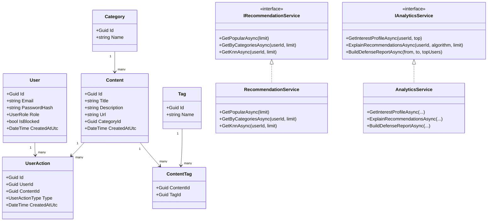
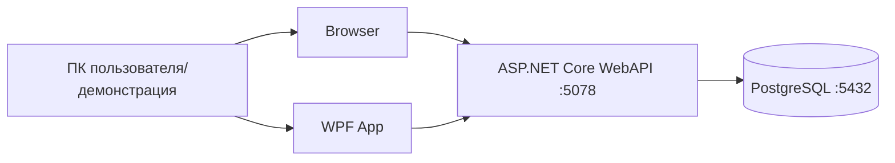
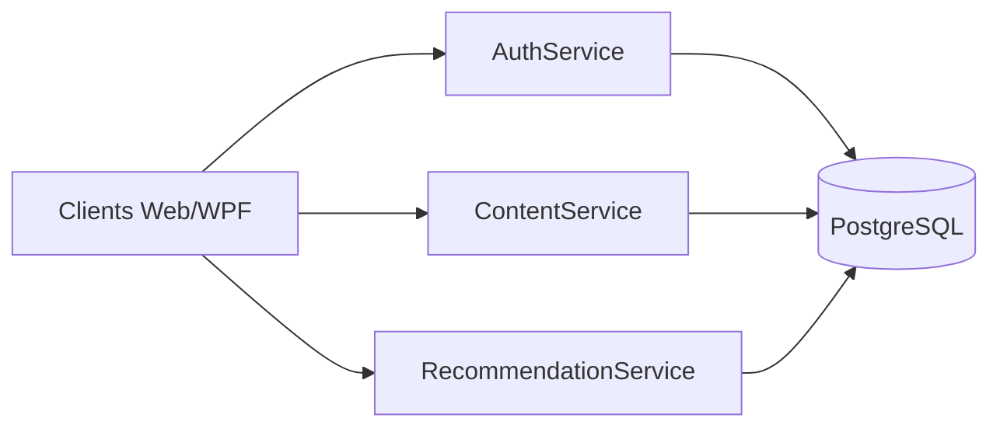

# Диаграммы проекта (Mermaid)

Ниже набор диаграмм для защиты диплома. Их можно вставлять в Markdown-рендер, Mermaid Live Editor, draw.io (через Mermaid), Notion, Obsidian или скриншотить в презентацию.

---

## 1) Диаграмма компонентов (высокий уровень)

---

## 2) Диаграмма слоев (Clean Architecture)

---

## 3) ER-диаграмма базы данных

---

## 4) Поток данных (DFD, уровень 1)

---

## 5) Sequence: получение рекомендаций

---

## 6) Sequence: действие пользователя -> обновление профиля интересов

---

## 7) UML-диаграмма классов (упрощенная)

---

## 8) Deployment-диаграмма (для демонстрации)

---

## 9) Логическое микросервисное разделение (для слайда с перспективой)

